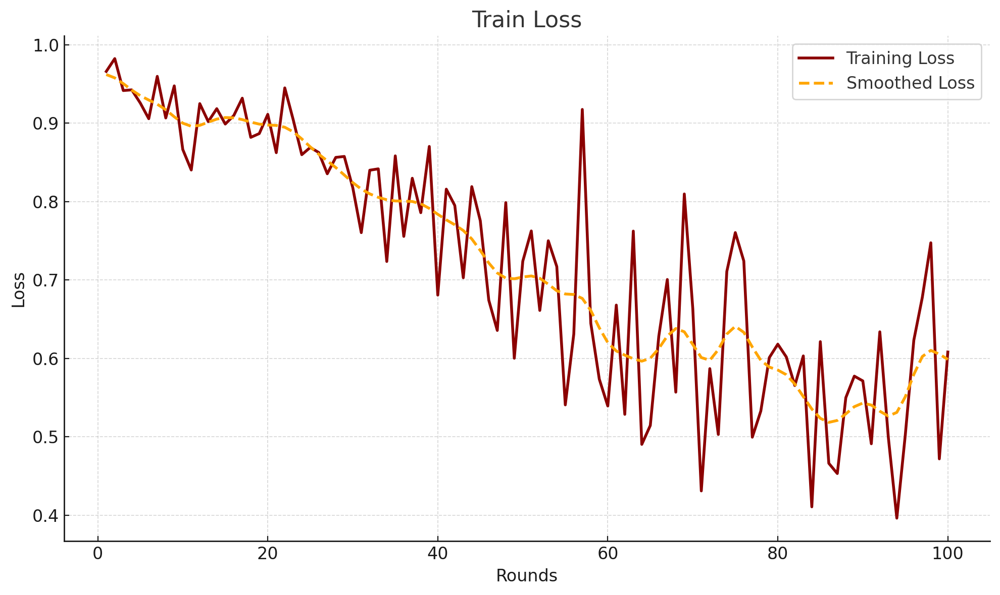

# FlowerTune LLM on General NLP Dataset

This directory conducts federated instruction tuning with a pretrained [microsoft/phi-4](https://huggingface.co/microsoft/phi-4) model on a [General NLP dataset](https://huggingface.co/datasets/vicgalle/alpaca-gpt4).
We use [Flower Datasets](https://flower.dev/docs/datasets/) to download, partition and preprocess the dataset.
Flower's Simulation Engine is used to simulate the LLM fine-tuning process in federated way,
which allows users to perform the training on a single GPU.


## PEFT Adapter

The fine-tuning results have been submitted as a PEFT adapter and can be accessed here:

[FlowerTune-phi4-NLP-PEFT](https://huggingface.co/mrs83/FlowerTune-phi-4-NLP-PEFT)


## Methodology

This experiment performs federated LLM fine-tuning with [DoRA](https://arxiv.org/abs/2402.09353) using the [🤗PEFT](https://huggingface.co/docs/peft/en/index) library.
The clients' models are aggregated with FedAvg strategy.
This provides a baseline performance for the leaderboard of General NLP challenge.


### microsoft/phi-4

For the **microsoft/phi-4** model I adopted the following fine-tuning methodology:

- **Precision**: `bf16` for model weights.
- **Quantization**: `4-bit` quantization for reduced memory usage.
- **[DoRA](https://arxiv.org/abs/2402.09353) Configuration**:
  - Rank (r): `8`
  - Alpha: `16`
  - Target Modules:
    - `qkv_proj`
    - `o_proj`
    - `gate_up_proj`
    - `down_proj`
- **Training Configuration**:
  - Batch size: `8`
  - Maximum number of steps: `10`
  - Total number of rounds: `100`
  - Fraction fit per round: `0.1`
- **Learning Rate Scheduler**:
  - Cosine Annealing over rounds, where:
    - Maximum LR: `5e-5`
    - Minimum LR: `5e-6`
  - Constant learning rate scheduler over steps
- **Strategy**: `FedAvg`

### Training Loss Visualization

Below is the training loss plot from the experiment:



This methodology enabled efficient fine-tuning within constrained resources while ensuring competitive performance.

### Evaluation Results (Accuracy)

- **STEM**: 40.66 %
- **Social Sciences**: 74.52 %
- **Humanities**: 51.75 %
- **Average**: 55.64 %

### Communication Budget

45804.69 Megabytes

## Environments setup

Project dependencies are defined in `pyproject.toml`. Install them in an activated Python environment with:

```shell
pip install -e .
```

## Experimental setup

The dataset is divided into 20 partitions in an IID fashion, a partition is assigned to each ClientApp.
We randomly sample a fraction (0.1) of the total nodes to participate in each round, for a total of `100` rounds.
All settings are defined in `pyproject.toml`.

> [!IMPORTANT]
> Please note that `[tool.flwr.app.config.static]` and `options.num-supernodes` under `[tool.flwr.federations.local-simulation]` are not allowed to be modified for fair competition if you plan to participated in the [LLM leaderboard](https://flower.ai/benchmarks/llm-leaderboard).


## Running the challenge

Run the challenge with default config values.
The configs are defined in `[tool.flwr.app.config]` entry of `pyproject.toml`, and are loaded automatically.

```bash
flwr run
```

## VRAM consumption

Given a Mistral-7B model with 4-bit quantization, the estimated VRAM consumption per client for each challenge is:

| Challenges | GeneralNLP |   Finance  |   Medical  |    Code    |
| :--------: | :--------: | :--------: | :--------: | :--------: |
|    VRAM    | ~25.50 GB  | ~17.30 GB  | ~22.80 GB  | ~17.40 GB  |

You can adjust the CPU/GPU resources you assign to each of the clients based on your device, which are specified with `options.backend.client-resources.num-cpus` and `options.backend.client-resources.num-gpus` under `[tool.flwr.federations.local-simulation]` entry in `pyproject.toml`.


## Model saving

The global PEFT model checkpoints are saved every 5 rounds after aggregation on the sever side as default, which can be specified with `train.save-every-round` under [tool.flwr.app.config] entry in `pyproject.toml`.

> [!NOTE]
> Please provide the last PEFT checkpoint if you plan to participated in the [LLM leaderboard](https://flower.ai/benchmarks/llm-leaderboard).


## How to Get Started with the Model

Use this model as:

```
from peft import PeftModel
from transformers import AutoModelForCausalLM

base_model = AutoModelForCausalLM.from_pretrained("microsoft/phi-4")
model = PeftModel.from_pretrained(base_model, "mrs83/FlowerTune-phi-4-NLP-PEFT")
```
